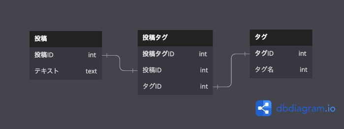

## 課題1

- 検索時にパターンマッチが必要となる
  - クエリの複雑性が増す可能性がある
  - 想定しないものを取得する可能性がある
- 想定していない値を入れることができてしまう
  - 同じ意味合いの単語でも別のタグとして登録される可能性がある
    - 例：書物と本など

## 課題2

交差テーブルを設ける。

## 課題3

- 下記のような多数のユーザーと共有を可能とするサービス。共有済みユーザーのidを1つのカラムで管理することが懸念される。
    - googleドキュメント、スプレッドシート
    - Miro
    - Notion

