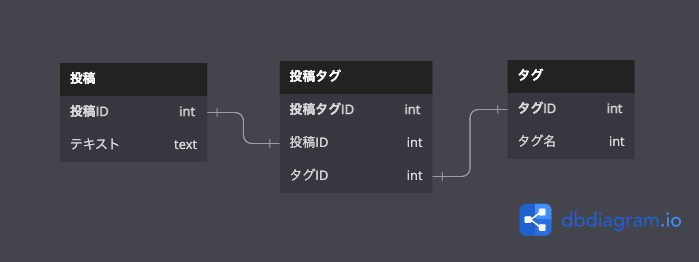

## 課題 1

- タグをもとに where 句にて検索する場合、全てのタグカラムを条件に指定しないといけない。
- 今後タグを増やす場合、カラムの追加をしないといけない。
- 削除された場合は空白になる。その後に追加する際は、最初の null に値を入れるなど更新ルールが発生する。また、そのようなクエリは複雑になる。
- タグ名を参照する場合、結合が発生するが、値が入っているかどうかを確認しなければいけない。

## 課題 2

交差テーブルを設ける。

## 課題 3

- EC サイトにおいて、ユーザーごとに配送先となる住所を１カラムで管理していたが、複数の配送先を登録できるようにしたいという要望から、配送先２、配送先３と追加した。その結果、アンチパターンとなった。
