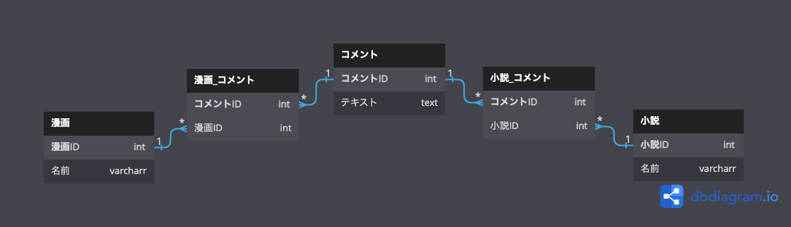

## 課題 1

- 1つのカラムで2つのテーブルに参照しているため、外部キー宣言ができない。
    - 参照整合性制約（参照先にレコードがあること）を保証できない。
- 結合時に全てのテーブルを選択しないといけない。
    - 対象ではないテーブルの結果にNULLが入ってしまう。
- 対象テーブルのコメントを取得する際は、取得時にTYPEを必ず指定しないといけないルールが発生する。
  - 指定漏れがありバグが発生する根本原因となる。

## 課題 2

交差テーブルを設ける。

## 課題 3

- 顧客の購入履歴を管理する。複数のサービスタイプに紐づくメニューや商品があるサービスの場合、１つのカラムで管理しようとし、アンチパターンに陥る。
  - 例：パーソナルトレーニングや整体などのサービスを提供しており、それぞれに30分、60分などのメニューがある。
