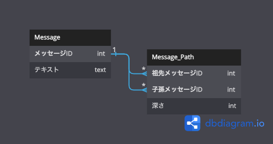

## 課題 1

- 親とその子レコードを削除する場合、外部キー制約により子から削除する必要がある。
- 親レコードのみを削除する場合、整合性を担保できない。親子関係を適切に組み替える必要性があるが、そのためのクエリは複雑になる。
- 全階層、特定の階層の取得が難しい。階層数を把握できないと取得できない。

## 課題 2

閉包テーブルとする。

## 課題 3

- 商品が属するカテゴリーを管理するテーブルにおいて、階層は固定されていたが、新たな別の業種の商品を対応することになり、階層を増やす必要が出てきてアンチパターンに陥った。
