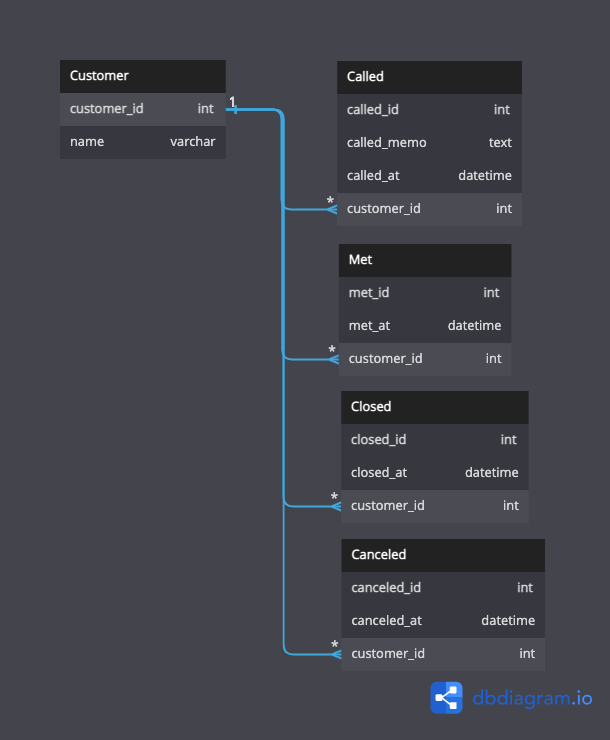

## 課題 1

- 複数回面談をした場合、面談日時が更新されるため、前回いつ行ったのか、何回行ったのかが分からない。
- 一度成約した後に解約し、後にまた同じ人が成約した場合、`closed`の値が切り替わる。現在の状態しか分からない。成約日は更新され、過去にいつ成約したのか、解約日はいつかが分からない。

## 課題 2

- イベントごとにテーブルを用意する。
- 顧客のステータスをマスタ値として格納するカラムを用意してもよさそう。例えば、電話、商談、成約、解約などが入る。
  - ユースケースとして、解約した顧客にキャンペーン情報のメルマガをを一斉に送るなど。

## 課題 3

ジムなどの顧客の情報を管理するシステム。
月に1度カウンセリングなどを行って、内容をmemoカラムに記録しているとする。このような場合、2ヶ月前のmemoの内容を把握することができない。

