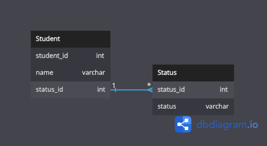

## 課題 1

1. 制約に追加した項目の一覧を取得するのが難しい
   - メタ情報をもとに制約内容を取得できることはできるが、アプリケーション上では使えない？
   - 仮にアプリケーション上など、別の場所で値の一覧を管理すると DRY 原則に反する？
2. チェック制約値の追加、削除においてテーブル定義の変更を行う必要がある
3. 他 DB 製品への移行があった場合に定義変更などが必要となる

[検証クエリ](./db-anti-6.sql.md)

## 課題 2

## 課題 3

社員情報を管理するシステム。現在の社員の状態をcheck 制約として「在職」「退職」「休職」としてもうけた。
