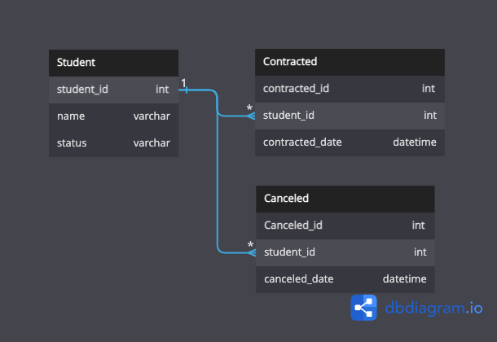
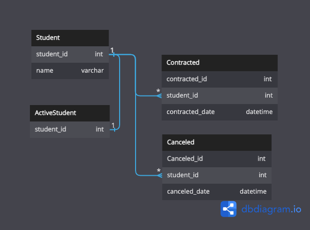

## 課題 1

- 常に where 句を指定しないといけない。
- 削除イベントが発生した日時を参照したい場合に参照できない。

## 課題 2

- ステータスを持つ

    

    常にwhere句をつけないといけないという点であまり解決策になってないか？
    論理削除フラグよりカラムの意味合いが分かりやすいため扱いやすいのでは？

- アクティブなユーザーを管理するテーブルを用意する

    
    
    整合性を保つためにトリガーを使うといった対応が必要。

## 課題 3

### 3-1

- 再度購入したい場合に対応するため、キャンセル済みの商品を一覧表示したい。
- 過去にキャンセルした商品も含めてアルゴリズムを用いて、その人に合わせたおすすめ商品を出したい。

### 3-2

- 再入会した生徒の学習計画をたてたいが、過去の進捗データが残っておらず、計画を立てることができない。

### 3-3

そのような意思決定を行った機会はないですが、基本的には論理削除を採用しています。
論理削除だと安心だからという背景があると思います。実際のところ、物理削除を採用するためには、多くのユースケースを想定しておかないといけないですし、なかなか採用するのは怖いみたいな意見も多いのかなと。
