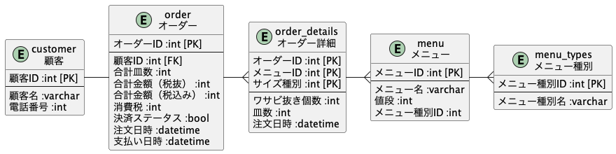

# DBモデリング1

## 課題1

### オーダーテーブル
  合計金額は税抜価格で。別で消費税のカラムを持っておく。
  税率自体は別テーブルかプロパティファイルなどで管理。
  合計金額（税込み）をカラムとして持たない理由は、最低限必要なカラムを持てばよいという思想で設計しているため。

### 注文詳細テーブル
  注文詳細テーブルは、オーダーID、メニューID、サイズ種別で複合キーとした。
  これにより、顧客の嗜好に合わせた注文を可能に。

  例えば、

   - マグロ赤身×大×2皿（ワサビぬき×1皿）
   - マグロ赤身×小×3皿（ワサビぬき×1皿）
   - オニオンサーモン×中×1皿（ワサビぬき×0皿）

  など。

#### ※補足

- ワサビぬき個数はデフォルトで0。

## 課題2

- シャリの大きさに関して 
  上記ER図に大中小をそれぞれ、1,2,3と選べるカラムを追加して複合キーとした。デフォルトで2（中）となる仕様に。

- 月ごとの集計について 
  注文詳細テーブルに注文日時を持たせることで集計可能。

## 課題3

- 追加仕様の想定
  - 事前に予約による取り置きが可能となった。
  - サイドメニューが増えた。
