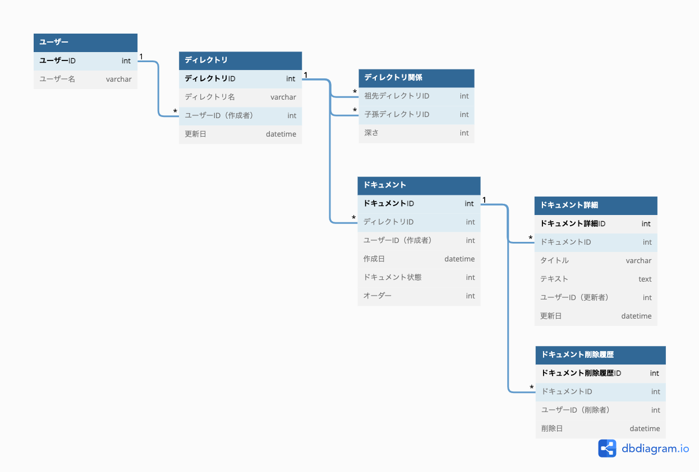

## 課題１

 

- ドキュメント詳細テーブルについて 
バージョンを管理できるよう更新があるごとにレコードに追加する。

- 削除について 
  - ドキュメントとディレクトリは物理削除とする。ドキュメントは元に戻せるよう`ドキュメント状態`を`削除`などとして一定期間が経てば削除とする。
  - 状態には他に`編集中`とかがあるかも？今後共同編集などの仕様が追加された時に使えたりしそう？（「〇〇さんが編集しています」やカーソルに色をつけるとか？）

## 課題2

 

- レコードに自身の順番`order`を持たせることで対応
- ディレクトリとオーダーで一意にする(複合ユニーク制約?)

### 参考

- [並べ替えできるデータをデータベースに保存する方法](https://zenn.dev/itte/articles/e97002637cd3a6) 
- [DB設計 順番を持ったデータの順序を更新する際の処理方法について](https://teratail.com/questions/117201)