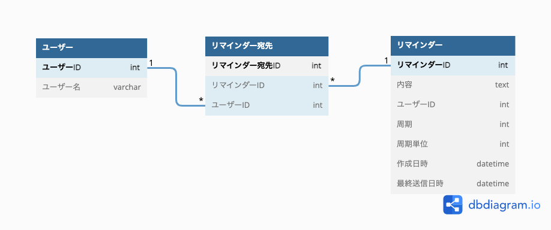
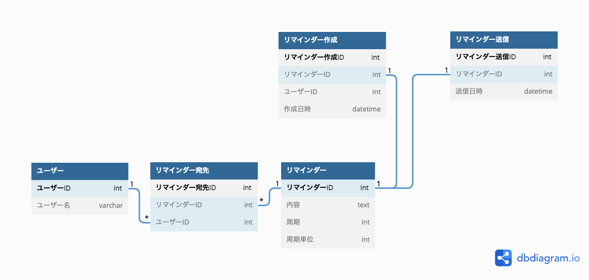

## 課題１

## 考えたこと

- 周期について 
  周期は「日数」を数値で持たせればいいと考えたが、月によって日数が変わるため、「毎月X日」という制御ができなくなるのでは。
  そのため、周期単位カラムを設けて「月」と「日」を保持できるようにして対応する。

- 送信処理について 
  - 初回：作成日時と現在の時刻を比較して、1時間以内なら初回送信と判断。
  - 初回以降：最終送信日時を保持していることで、現在と比較して送信の制御を行うことができるのでは。

- リマインダー完了時の振る舞いについて 
  - 「終わった！」を押せば、リマインダー宛先テーブルから対象ユーザーのレコードを物理削除する。
  - 全員が「終わった！」を押せば、宛先がいなくなるため、リマインダーテーブルの対象レコードも物理削除する。

### 追記

[イミュータブルデータモデル](https://scrapbox.io/kawasima/%E3%82%A4%E3%83%9F%E3%83%A5%E3%83%BC%E3%82%BF%E3%83%96%E3%83%AB%E3%83%87%E3%83%BC%E3%82%BF%E3%83%A2%E3%83%87%E3%83%AB)について読んだのでそれをもとに再度モデリングを考えてみた。

### 考えたこと

- 更新がないデータモデルに
上のモデリングでは、送信ごとにupdateが入るためかなり更新性が高いデータモデルだった...

- イベントとリソースについて 
上がイベントで下がリソース。今回のイベントを洗い出すと、
  1. リマインダーを作成する
  2. リマインダーを送信する
  3. 「終わった！」を押す

  ぐらいなのかなと。3に関してはリマインダー宛先テーブルから対象ユーザーのものを物理削除する。

- リマインダーの物理削除について 
全員がリマインダーを完了すると、対象のリマインダーも物理削除するという想定だったが、リマインダー作成テーブルなどに紐づいているため、リマインダー自体は削除しない方がいいのでは。（物理削除するのはリマインダー宛先テーブルのみ）

