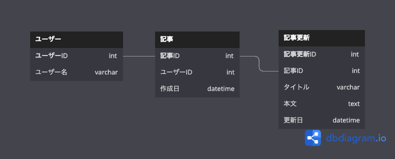

## 課題１

- 記事更新テーブルは更新されるごとにインサートしていく
- 最新記事の一覧取得する際は、記事ID毎に更新日時が最新のものを取得

## 課題2

### 2-1

- 分析に最適化されているデータウェアハウスを活用すればいいのでは？

### 2-2

- メリット
  - イージーな設計であるため素早く実装できる

- デメリット
  - シンプルな設計ではない（責務が多い）ため更新のためのルールが多い
  <!-- - 最新記事を取得する際のクエリが複雑になる -->